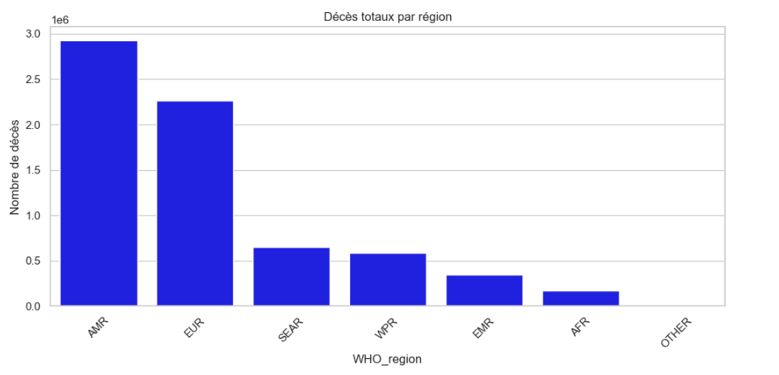
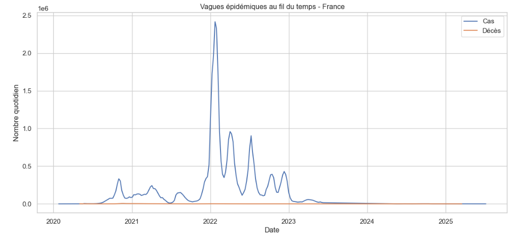
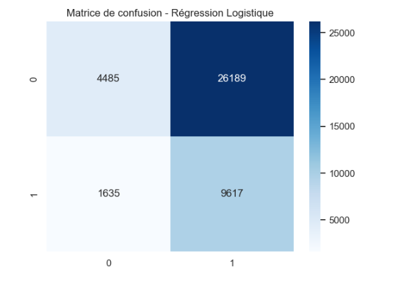
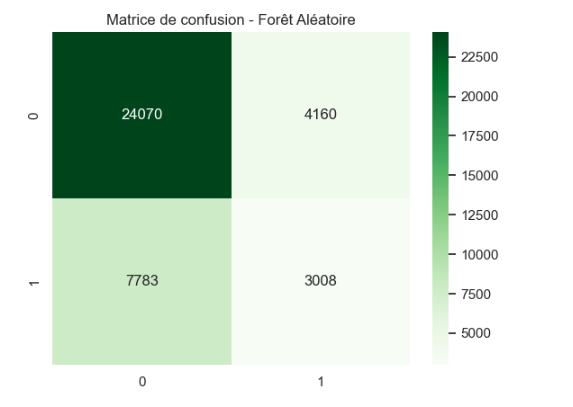
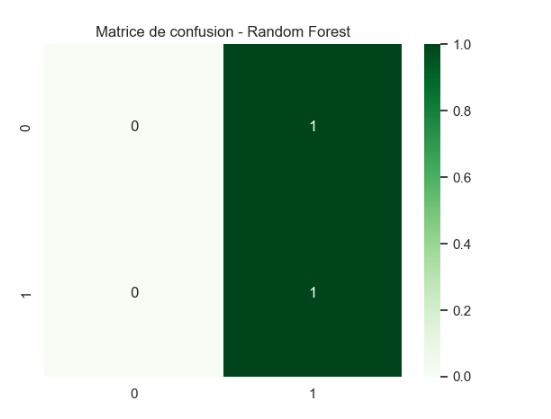
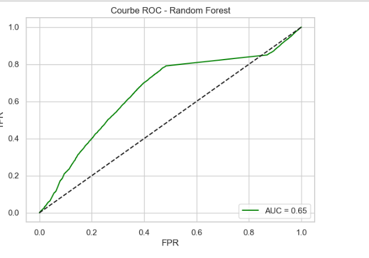

# COVID19
 Analyse et Prédiction de la COVID-19

 ## Aperçu du projet
Ce projet analyse les données officielles de la COVID-19 fournies par l’Organisation Mondiale de la Santé (OMS).  
L’objectif est d’explorer le jeu de données, de construire des modèles de Machine Learning pour la prédiction/classification, et de fournir des informations utiles pour la prise de décision en santé publique.  

#### Courte description
Nous avons collecté les statistiques mondiales de la COVID-19 (cas, décès, hospitalisations, vaccinations).  
Les données ont été nettoyées et préparées, une analyse exploratoire a été réalisée, des modèles de Machine Learning (régression logistique, forêt aléatoire) ont été construits, et une classification a été effectuée pour détecter les zones à **haut risque**.  
Enfin, des visualisations et des recommandations ont été produites.

## Compréhension du problème (Business Understanding)
- **Problème** : Les autorités de santé publique ont besoin d’anticiper les hausses potentielles de cas de COVID-19.  
- **Objectif** : Construire un modèle prédictif capable de classifier si un pays/région est en **haut risque** d’une flambée épidémique.  
- **Critères de succès** : Obtenir une précision d’au moins 75% et générer des insights exploitables par les décideurs.  

## Compréhension des données (Data Understanding)
- **Source** : OMS – bases de données officielles COVID-19 (cas, décès, vaccination, tests).  
- **Format** : Fichiers CSV mis à jour régulièrement.  
- **Variables disponibles** :  
  - Date, Pays, Cas, Décès, Hospitalisations  
  - Taux de vaccination (% de population vaccinée)  
  - Indicateurs de politique sanitaire (confinement, port du masque, etc.)  
- **Observations initiales** :  
  - Données manquantes pour certains pays.  
  - Hétérogénéité dans la fréquence de mise à jour (quotidienne vs hebdomadaire).
 
  - ## Préparation des données (Data Preparation)
Étapes effectuées :  
1. Chargement des fichiers CSV (base OMS).  
2. Nettoyage des valeurs manquantes et doublons.  
3. Conversion des dates au format `datetime` et création de nouvelles variables temporelles (semaine, mois, année).  
4. Normalisation des mesures par population (cas pour 100 000 habitants, décès pour 100 000 habitants).  
5. Création d’une variable cible **Haut_Risque (0/1)** = 1 si augmentation des cas >20% dans les 14 jours suivants.  

### Librairies pour la manipulation de données
- `pandas (pd)` : création et manipulation des DataFrames.
- `numpy (np)` : calculs numériques et traitement de matrices/vecteurs.

### Librairies pour visualisation
- `matplotlib.pyplot (plt)` : création de graphiques personnalisables.
- `seaborn (sns)` : rend les graphiques plus esthétiques et fournit des fonctions statistiques avancées.

### Librairies pour Machine Learning
- `train_test_split` : divise les données en ensembles d’entraînement et test.
- `GridSearchCV` : recherche automatique des meilleurs hyperparamètres via validation croisée.
- `TimeSeriesSplit` : pour séries temporelles, division chronologique des données.
- `StandardScaler` : normalise les variables numériques (moyenne=0, écart-type=1).
- `Pipeline` : permet de chaîner plusieurs étapes (ex : normalisation + modèle).
- `LogisticRegression` : modèle de régression logistique pour classification binaire.
- `RandomForestClassifier` : modèle de forêt aléatoire basé sur plusieurs arbres de décision.

### Librairies pour évaluation des modèles
- `accuracy_score` : proportion de prédictions correctes.
- `precision_score` : proportion de vrais positifs parmi les prédictions positives.
- `recall_score` : proportion de vrais positifs parmi les vrais positifs totaux.
- `f1_score` : moyenne harmonique de précision et rappel.
- `confusion_matrix` : matrice affichant vrais/faux positifs et négatifs.
- `roc_auc_score` : surface sous la courbe ROC.
- `roc_curve` : points pour tracer la courbe ROC.
- `classification_report` : résumé complet des métriques (precision, recall, f1, support).

### Gestion des avertissements
- `warnings.filterwarnings('ignore')` : ignore les warnings éventuels, par exemple sur des paramètres dépréciés.

### Affichage graphique
- `sns.set(style="whitegrid")` : style des graphiques avec fond blanc et grille discrète, pour plus de lisibilité.
- 
``` python
# 1. Import des librairies principales
import pandas as pd
import numpy as np
import matplotlib.pyplot as plt
import seaborn as sns
# Machine Learning
from sklearn.model_selection import train_test_split, GridSearchCV, TimeSeriesSplit
from sklearn.preprocessing import StandardScaler
from sklearn.pipeline import Pipeline
from sklearn.linear_model import LogisticRegression
from sklearn.ensemble import RandomForestClassifier
from sklearn.metrics import (
    accuracy_score, precision_score, recall_score, f1_score,
    confusion_matrix, roc_auc_score, roc_curve, classification_report
)

# Pour gérer les avertissements éventuels
import warnings
warnings.filterwarnings('ignore')

# Affichage plus clair
sns.set(style="whitegrid")

```
#  Chargement des données COVID-19

Dans cette section, nous allons **importer les données COVID-19** fournies par l’Organisation mondiale de la santé (OMS) et effectuer une première vérification pour comprendre la structure du jeu de données.

---

## 1. Charger les données

```python
# 2. Charger les données 
df = pd.read_csv("Data/WHO-COVID-19-global-daily-data.csv")
```
# Vérification et nettoyage des données

Avant de commencer l’analyse, il est essentiel de **vérifier la qualité des données** et de procéder à un **nettoyage**.  
Cela permet d’éviter les erreurs et de rendre le jeu de données exploitable.

---

## 1. Vérifier les informations générales

```python
print(df.info())
print("\nValeurs manquantes par colonne :")
print(df.isna().sum())
```
#  Conversion des dates et création de variables temporelles

Après avoir converti la colonne **`Date_reported`** en format `datetime`, il est possible d’extraire de nouvelles variables temporelles.  
Ces variables facilitent les analyses **par période** (semaine, mois, année).

---

## 1. Création des colonnes temporelles

```python
df["semaine"] = df["Date_reported"].dt.isocalendar().week
df["mois"] = df["Date_reported"].dt.month
df["année"] = df["Date_reported"].dt.year
```
#  Création de la variable cible : `Haut_Risque`

Dans cette étape, nous créons une variable **cible binaire** qui permettra d’identifier les pays ou situations considérées comme étant à **haut risque** d’augmentation des cas de COVID-19.

---

```python
# Trier les données par pays et date
df = df.sort_values(['Country', 'Date_reported'])

# Calcul du nombre de cas 14 jours après
df['Cas_14j'] = df.groupby('Country')['New_cases'].shift(-14)

# Calcul de l'augmentation en pourcentage
df['Augmentation'] = (df['Cas_14j'] - df['New_cases']) / df['New_cases']

# Définition de la variable cible : 1 si augmentation > 20%, sinon 0
df['Haut_Risque'] = np.where(df['Augmentation'] > 0.2, 1, 0)

# Supprimer les lignes finales sans Cas_14j
df.dropna(subset=['Cas_14j'], inplace=True)

# Affichage des premières lignes
df[['Country','Date_reported','New_cases','Cas_14j','Augmentation','Haut_Risque']].head(10)
```
### Préparer les features (X) et la cible (y) pour l’entraînement des modèles

Dans cette étape, nous allons définir :

- **La cible (`y`)** : la variable que nous cherchons à prédire, ici `Haut_Risque`.  
- **Les features (`X`)** : les variables explicatives que nous allons fournir aux modèles d’apprentissage automatique.

---

#### Code Python

```python
# Définir la cible
y = df['Haut_Risque']

# Pour l’instant, on prend des features simples (on pourra enrichir plus tard)
X = df[['New_cases', 'New_deaths', 'semaine', 'mois', 'année']]

# Vérifions les dimensions
print("Shape X :", X.shape)
print("Shape y :", y.shape)

# Affichage des premières lignes de X
X.head()
```
### Distribution des cas et décès par région

Dans cette partie, nous analysons la répartition **des cas** et **des décès** de COVID-19 par région de l’OMS (`WHO_region`).

---

#### Code Python

```python
# Cas et décès totaux par région
region_cases = df.groupby('WHO_region')['New_cases'].sum().sort_values(ascending=False)
region_deaths = df.groupby('WHO_region')['New_deaths'].sum().sort_values(ascending=False)

# Cas totaux par région
region_cases_df = region_cases.reset_index()
region_cases_df.columns = ['WHO_region', 'Total_Cases']

plt.figure(figsize=(12,5))
sns.barplot(
    x='WHO_region',
    y='Total_Cases',
    data=region_cases_df,
    color="red",    # on remplace palette par color
)
plt.title("Cas totaux par région")
plt.ylabel("Nombre de cas")
plt.xticks(rotation=45)
plt.show()
```

<p style='text-align: center; font-style: italic; color: #7f8c8d;'>
</p>

```python
# Décès totaux par région
region_deaths_df = region_deaths.reset_index()
region_deaths_df.columns = ['WHO_region', 'Total_Deaths']

plt.figure(figsize=(12,5))
sns.barplot(
    x='WHO_region',
    y='Total_Deaths',
    data=region_deaths_df,
    color="blue",   # on remplace palette par color
)
plt.title("Décès totaux par région")
plt.ylabel("Nombre de décès")
plt.xticks(rotation=45)
plt.show()
```

<p style='text-align: center; font-style: italic; color: #7f8c8d;'>
</p>


### Visualisation des vagues épidémiques au fil du temps  

Dans cette étape, on représente graphiquement l’évolution du nombre de cas et de décès dans un pays donné, afin d’identifier les vagues épidémiques.  
Nous choisissons ici la **France** comme exemple.  

```python
plt.figure(figsize=(14,6))
# Exemple pour un pays spécifique, par ex. "France"
country = "France"
df_country = df[df['Country']==country]

# Tracer les cas et décès au fil du temps
sns.lineplot(x='Date_reported', y='New_cases', data=df_country, label='Cas')
sns.lineplot(x='Date_reported', y='New_deaths', data=df_country, label='Décès')

# Personnalisation du graphique
plt.title(f"Vagues épidémiques au fil du temps - {country}")
plt.xlabel("Date")
plt.ylabel("Nombre quotidien")
plt.legend()
plt.show()
```

<p style='text-align: center; font-style: italic; color: #7f8c8d;'>
</p>


### Préparation des données pour Machine Learning  

Avant d’entraîner nos modèles, nous devons préparer correctement les données :  
- Sélectionner les variables explicatives (**features**) qui serviront de prédicteurs.  
- Définir la variable cible (**target**) : ici, `Haut_Risque`.  
- Normaliser les données pour que toutes les variables soient sur la même échelle.  
- Diviser le jeu de données en ensembles d’entraînement et de test.  

```python
# Sélection des colonnes existantes
features = ['New_cases', 'New_deaths']  # ajouter 'Taux_vaccination' si dispo
X = df[features].fillna(0)
y = df['Haut_Risque']

# Normalisation
scaler = StandardScaler()
X_scaled = scaler.fit_transform(X)

# Séparation train/test
X_train, X_test, y_train, y_test = train_test_split(
    X_scaled, y, test_size=0.2, shuffle=False
)

print("Données prêtes pour le ML")
```
### Régression Logistique  

Nous utilisons ici une **pipeline** combinant la normalisation des données et un classificateur de **régression logistique**.  
Un `GridSearchCV` permet de trouver le meilleur hyperparamètre `C` grâce à une validation croisée (cv=3).  

```python
# Pipeline + GridSearch pour Logistic Regression
pipe_lr = Pipeline([
    ("scaler", StandardScaler()),
    ("clf", LogisticRegression(max_iter=1000, class_weight="balanced", random_state=42))
])

# Paramètres à tester
param_lr = {"clf__C": [0.1, 1, 3]}

# GridSearch avec validation croisée
grid_lr = GridSearchCV(pipe_lr, param_lr, scoring="f1", cv=3, n_jobs=-1)
grid_lr.fit(X_train, y_train)

# Prédiction
y_pred_lr = grid_lr.predict(X_test)

# Évaluation
print("=== Régression Logistique ===")
print(classification_report(y_test, y_pred_lr))

# Matrice de confusion
sns.heatmap(confusion_matrix(y_test, y_pred_lr), annot=True, fmt="d", cmap="Blues")
plt.title("Matrice de confusion - Régression Logistique")
plt.show()
```

<p style='text-align: center; font-style: italic; color: #7f8c8d;'>
</p>

### Modèle Random Forest simple

On entraîne un modèle **Random Forest** pour prédire la variable cible `Haut_Risque` à partir des colonnes `New_cases` et `New_deaths`.

```python
# --- Modèle Random Forest simple ---
rf = RandomForestClassifier(
    n_estimators=300,          # Nombre d'arbres dans la forêt
    max_depth=None,            # Profondeur maximale des arbres
    min_samples_split=2,       # Nombre minimum d'échantillons pour diviser un noeud
    min_samples_leaf=1,        # Nombre minimum d'échantillons dans une feuille
    random_state=42,
    n_jobs=-1                  # Utilisation de tous les cœurs pour l'entraînement
)

# Entraînement
rf.fit(X_train, y_train)

# Prédiction
y_pred_rf = rf.predict(X_test)

# Évaluation
print("=== Forêt Aléatoire simple ===")
print(classification_report(y_test, y_pred_rf))

# Matrice de confusion
sns.heatmap(confusion_matrix(y_test, y_pred_rf), annot=True, fmt="d", cmap="Greens")
plt.title("Matrice de confusion - Forêt Aléatoire")
plt.show()
```

<p style='text-align: center; font-style: italic; color: #7f8c8d;'>
</p>

### Exemple minimal : Random Forest avec GridSearchCV

Nous allons entraîner un modèle **Random Forest** sur un petit jeu de données fictif pour prédire la variable `Haut_Risque`.

```python
# 2. Exemple de dataframe minimal
df = pd.DataFrame({
    "New_cases": [10, 20, 30, 40, 50, 60, 70, 80],
    "New_deaths": [1, 2, 3, 4, 5, 6, 7, 8],
    "Haut_Risque": [0,0,1,1,0,1,0,1]
})

# 3. Préparation des features et target
features = ["New_cases", "New_deaths"]
X = df[features].fillna(0)  # Remplacer les valeurs manquantes par 0
y = df["Haut_Risque"]

# 4. Normalisation et séparation train/test
X_scaled = StandardScaler().fit_transform(X)
X_train, X_test, y_train, y_test = train_test_split(X_scaled, y, test_size=0.2, shuffle=False)

# 5. Définition des hyperparamètres pour GridSearch
param_rf = {
    "n_estimators": [100, 200],       # Nombre d'arbres
    "max_depth": [None, 10, 20],      # Profondeur maximale
    "min_samples_split": [2, 5],      # Minimum d'échantillons pour diviser un noeud
    "min_samples_leaf": [1, 2]        # Minimum d'échantillons dans une feuille
}

# 6. GridSearchCV pour trouver la meilleure combinaison
grid_rf = GridSearchCV(
    RandomForestClassifier(random_state=42), 
    param_rf, 
    scoring="f1", 
    cv=3, 
    n_jobs=-1
)
grid_rf.fit(X_train, y_train)

# 7. Meilleur modèle
best_rf = grid_rf.best_estimator_
print("Random Forest entraînée avec GridSearch")
print("Meilleurs paramètres :", grid_rf.best_params_)
```
### Prédictions et évaluation du modèle Random Forest

Après avoir entraîné le modèle Random Forest avec GridSearchCV, on peut maintenant faire des prédictions et évaluer ses performances.

```python
# Prédictions sur l'ensemble de test
y_pred = best_rf.predict(X_test)

# Évaluation des performances
from sklearn.metrics import classification_report, confusion_matrix
import seaborn as sns
import matplotlib.pyplot as plt

print(classification_report(y_test, y_pred))

# Matrice de confusion
sns.heatmap(confusion_matrix(y_test, y_pred), annot=True, fmt="d", cmap="Greens")
plt.title("Matrice de confusion - Random Forest")
plt.show()
```

<p style='text-align: center; font-style: italic; color: #7f8c8d;'>
</p>

### Courbe ROC - Random Forest

La courbe ROC (Receiver Operating Characteristic) permet d'évaluer la capacité du modèle à distinguer les classes positives et négatives.

```python
# Probabilités pour la classe positive
y_prob = best_rf.predict_proba(X_test)[:,1]

# Calcul du ROC
from sklearn.metrics import roc_curve, roc_auc_score
import matplotlib.pyplot as plt

fpr, tpr, _ = roc_curve(y_test, y_prob)
roc_auc = roc_auc_score(y_test, y_prob)

# Visualisation
plt.figure(figsize=(7,5))
plt.plot(fpr, tpr, label=f"AUC = {roc_auc:.2f}", color="green")
plt.plot([0,1],[0,1], "k--")  # ligne diagonale pour un modèle aléatoire
plt.xlabel("False Positive Rate (FPR)")
plt.ylabel("True Positive Rate (TPR)")
plt.title("Courbe ROC - Random Forest")
plt.legend(loc="lower right")
plt.show()
```

<p style='text-align: center; font-style: italic; color: #7f8c8d;'>
 
 ## Recommandations commerciales basées sur l'analyse COVID-19
*Renforcer la surveillance dans les régions à forte augmentation des cas.*
 
 *Planification proactive des mesures sanitaires (campagnes de vaccination, communication
publique).*

 *Allocation des ressources (personnel, équipements, tests) en fonction des prédiction*


### Next Steps
Ajouter des données supplémentaires (vaccination, tests, densité population).

Tester d’autres modèles pour améliorer la précision. Créer un dashboard interactif pour
suivre en temps

réel les périodes à risque. Collaborer avec les autorités sanitaires pour adapter les stratégie


## Conclusion
Les modèles de Machine Learning permettent de prévoir les périodes à haut risque COVID19.

Ils aident les décideurs à prendre des décisions

éclairées et à mieux préparer les réponses sanitai

</p>

#### Email septamalouison634@gmail.com

#### Lien Linkedlin www.linkedin.com/in/septama-louison-03335a31a
 
